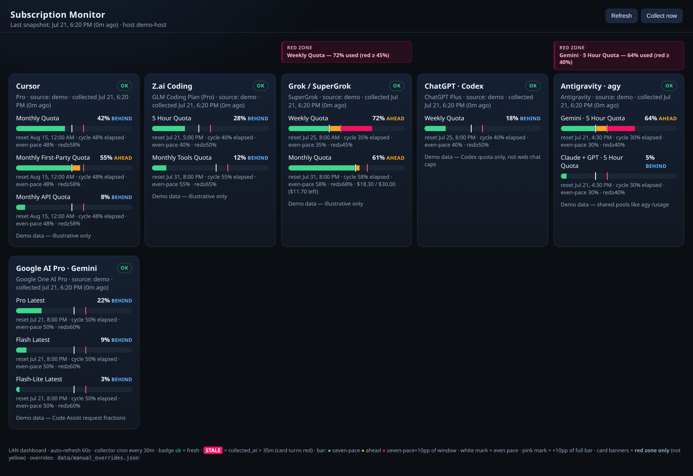

# Subscription Monitor

Local LAN dashboard for **multi-subscription AI coding usage** — pace bars, red-zone banners, and a 30‑minute collector loop.



*Demo data (`/?demo=1`) — no real accounts or emails.*

Tracks (when credentials are available):

| Card | What it meters |
|------|----------------|
| **Cursor** | Monthly included / first-party / API pools |
| **Z.ai Coding** | 5‑hour + monthly tools quotas |
| **Grok / SuperGrok** | Weekly credits + monthly $ limit |
| **ChatGPT · Codex** | Weekly (and 5‑hour when present) via Codex `wham/usage` |
| **Antigravity · agy** | Shared **Gemini** and **Claude + GPT** WTUS pools (matches `agy` `/usage`) |
| **Google AI Pro · Gemini** | Code Assist per‑model request fractions (not web chat, not Antigravity) |

> **Disclaimer:** Collectors call undocumented / session-authenticated provider endpoints. They can break when vendors change APIs. This is a personal ops tool, not an official product. Use at your own risk; keep tokens off the public internet.

---

## Features

- **Even-pace bars** — green ≤ even pace, yellow to pace+10pp, red beyond  
- **Per-card red-zone banners** only (yellow does not spam)  
- **Stale detection** — snapshot age &gt; 35 minutes → red badge + card chrome  
- **Optional auth** — `SUBMON_TOKEN` for LAN  
- **Manual overrides** — seed or force a provider when login is broken  
- **History** — daily JSONL under `data/history/` (gitignored)  
- **Demo mode** — `http://127.0.0.1:8787/?demo=1` serves sanitized fake data (good for screenshots)

---

## Quick start

```bash
git clone https://github.com/Suppressor72/subscription-monitor.git
cd subscription-monitor

python3 -m venv .venv
source .venv/bin/activate   # Windows: .venv\Scripts\activate
pip install -r requirements.txt

cp .env.example .env
# edit .env — at least SUBMON_TOKEN if binding on LAN

cp data/manual_overrides.example.json data/manual_overrides.json

# one-shot collect
python3 collect_all.py

# serve dashboard
python3 server.py
# → http://127.0.0.1:8787/
# → http://127.0.0.1:8787/?demo=1   (sanitized screenshot data)
```

Optional token URL: `http://127.0.0.1:8787/?token=your-secret`  
(The UI stores the token in `localStorage` after the first visit.)

### Cron (every 30 minutes)

```cron
*/30 * * * * cd /path/to/subscription-monitor && .venv/bin/python collect_all.py >> /tmp/submon-collect.log 2>&1
```

Or a systemd timer / your agent’s scheduler. The UI treats **&gt;35 minutes** since `collected_at` as stale.

---

## Hermes Agent (optional)

You do **not** need [Hermes Agent](https://hermes-agent.nousresearch.com) to run this. Plain Python + cron is enough.

This project was **built and is maintained with Hermes** as the ops layer: collectors drift when vendors change APIs, logins expire, and red-zone pacing needs a human-readable nudge. Hermes is a good fit for that maintenance loop.

If you already run Hermes:

| Hook | What to do |
|------|------------|
| **Cron** | Schedule `python collect_all.py` every 30m (or call `POST /api/collect`). Deliver only on red-zone / `login_required` / collector error if you want quiet ticks. |
| **Env** | `HERMES_HOME` is searched for `.env`, so API keys can live in a Hermes profile without a second secrets file. |
| **Skill** | Optional: a small skill that “check subscription dashboard, fix login_required, summarize red cards” so chat/`/skill` can re-collect and explain. |
| **PR loop** | When a provider endpoint breaks, point Hermes at this repo + a failing `collect_all.py` log and let it patch the collector. |

Example Hermes cron prompt (self-contained):

```text
Run: cd /path/to/subscription-monitor && python3 collect_all.py
Read data/latest.json. If any provider status is login_required/error, or any
alert level is critical/warn (red zone), summarize which cards and why in ≤8 lines.
If everything is ok and no red alerts, reply with exactly: OK
```

Pair with `no_agent` + script if you only want exit-code / JSON gatekeeping; use the agent when you want a written brief.

Standalone users: ignore this section and use system cron.

---

## Provider setup

Collectors fail soft: missing login → `login_required` / notes on the card. Wire only what you use.

### Z.ai Coding Plan
Set `GLM_API_KEY` or `ZAI_API_KEY` in `.env` (or process env). Uses the official quota API.

### Cursor
Prefer staying logged into [cursor.com](https://cursor.com) in Chrome; the collector reads `WorkosCursorSessionToken` via `browser-cookie3`.

```bash
# Optional overrides
export CURSOR_CHROME_COOKIES="$HOME/.config/google-chrome/Default/Cookies"
# or paste the session cookie value:
export CURSOR_SESSION_TOKEN='...'
```

Requires: `pip install browser-cookie3` (listed in `requirements.txt`).

### Grok / SuperGrok
Needs a working `grok` CLI login on the host (`~/.grok/auth.json`). Weekly via ACP billing; monthly $ via CLI chat-proxy billing.

### ChatGPT · Codex
`codex login` (Sign in with ChatGPT) → `~/.codex/auth.json`.  
Meters **Codex** usage (`chatgpt.com/backend-api/wham/usage`), **not** ChatGPT web message caps.

### Google AI Pro · Code Assist (Gemini card)
`gemini` CLI Google sign-in → `~/.gemini/oauth_creds.json`.  
Calls `cloudcode-pa` `loadCodeAssist` + `retrieveUserQuota`.  
**Important:** User-Agent must **not** contain `GeminiCLI` (Google rejects some CLI fingerprints).

OAuth *client* id/secret (installed-app client inside `@google/gemini-cli`) is resolved automatically when Gemini CLI is installed, or via:

```bash
export GEMINI_OAUTH_CLIENT_ID=...
export GEMINI_OAUTH_CLIENT_SECRET=...
# or copy data/oauth_clients.example.json → data/oauth_clients.json
```

This is **not** the same meter as Antigravity / `agy`.

### Antigravity · agy
Uses Cockpit OAuth at `~/.antigravity_cockpit/credentials.json` and  
`https://daily-cloudcode-pa.googleapis.com` `fetchAvailableModels` with an `antigravity/...` User-Agent.

OAuth client is auto-read from the installed **Antigravity Cockpit** extension, or set `ANTIGRAVITY_OAUTH_CLIENT_ID/SECRET` / `data/oauth_clients.json`.

Shows shared groups matching the TUI `/usage` copy:

- **Gemini · 5 Hour / Weekly Quota** (binding window from `resetTime`)
- **Claude + GPT · …**

The public API returns one `remainingFraction` per model (the binding window). When the 5‑hour pool is tighter, you see 5h; when it is full, the same field often reflects weekly.

---

## Configuration

| Variable | Purpose |
|----------|---------|
| `SUBMON_TOKEN` | Optional shared secret for UI/API |
| `SUBMON_HOST` / `SUBMON_PORT` | Bind (default `0.0.0.0:8787`) |
| `SUBMON_DATA` | Override data directory |
| `SUBMON_ENV` | Override `.env` path |
| `HERMES_HOME` | Also searched for `.env` (Hermes installs) |
| `GLM_API_KEY` / `ZAI_API_KEY` | Z.ai |
| `CURSOR_SESSION_TOKEN` | Cursor cookie override |
| `CURSOR_CHROME_COOKIES` | Path to Chrome Cookies DB |

Env load order for keys: **process env** → `SUBMON_ENV` → `./.env` → `$HERMES_HOME/.env` → `~/.hermes/.env`.

### Manual overrides

`data/manual_overrides.json` (copy from the `.example`):

```json
{
  "cursor": {
    "force_manual": true,
    "plan": "Pro",
    "pct_used": 12,
    "cycle_start": "2026-07-19T00:00:00-04:00",
    "cycle_end": "2026-08-19T00:00:00-04:00"
  }
}
```

Set `"force_manual": true` to skip the live collector for that provider.

---

## Pace & alerts

| Band | Rule |
|------|------|
| Green | `pct_used ≤ pct_time_elapsed` (even pace) |
| Yellow | between pace and **pace + 10 percentage points** of the full bar |
| Red | `pct_used ≥ even-pace + 10pp` |

**Card banners fire only in red** (plus stale / login / collector errors).  
No-cycle meters (no reset clock) use absolute bands: green ≤60, yellow ≤80, red &gt;80.

---

## Layout

Default grid: **5 cards on row 1**, remaining card(s) on row 2.  
Per-row banner slots equalize to the tallest red banner so card tops align.

---

## Project layout

```
subscription-monitor/
├── collect_all.py          # run all collectors → data/latest.json
├── server.py               # FastAPI + static UI
├── collectors/
│   ├── common.py           # snapshot, pace, env helpers
│   ├── cursor.py
│   ├── zai.py
│   ├── grok.py
│   ├── chatgpt.py
│   ├── gemini.py           # Code Assist
│   └── antigravity.py      # agy / daily-cloudcode-pa
├── static/index.html       # dashboard
├── docs/
│   ├── demo-latest.json    # sanitized demo payload
│   └── assets/             # README screenshots
├── data/                   # gitignored runtime (create locally)
├── requirements.txt
└── .env.example
```

---

## Security notes

- Do **not** commit `.env`, cookies, OAuth JSON, or `data/latest.json`.
- Prefer `SUBMON_TOKEN` whenever binding on `0.0.0.0`.
- Session cookies and OAuth refresh tokens are powerful — treat the host as trusted.
- Snapshots drop collector `raw` payloads before write to reduce accidental secret leakage.
- README screenshot uses `/?demo=1` only — never publish a capture of live `latest.json`.

---

## Extending

1. Add `collectors/myprovider.py` with a `collect() -> dict` using `provider_record(...)`.
2. Import and append in `collect_all.py`.
3. Add a label (and optional order entry) in `static/index.html` (`ORDER` / `LABELS`).

Window shape (minimal):

```python
{
  "name": "Weekly Quota",
  "kind": "weekly",
  "pct_used": 42.0,
  "pct_time_elapsed": 30.0,   # optional; enables pace coloring
  "resets_at": "2026-07-28T12:00:00+00:00",
  "pace": "ahead",            # from pace_status()
}
```

---

## License

MIT — see [LICENSE](LICENSE).

---

## Credits

Built as a personal ops dashboard for juggling Cursor, Z.ai, Grok, Codex, Gemini Code Assist, and Antigravity quotas on one LAN page. Maintained with [Hermes Agent](https://hermes-agent.nousresearch.com); runs fine without it. PRs and tweaks welcome.
